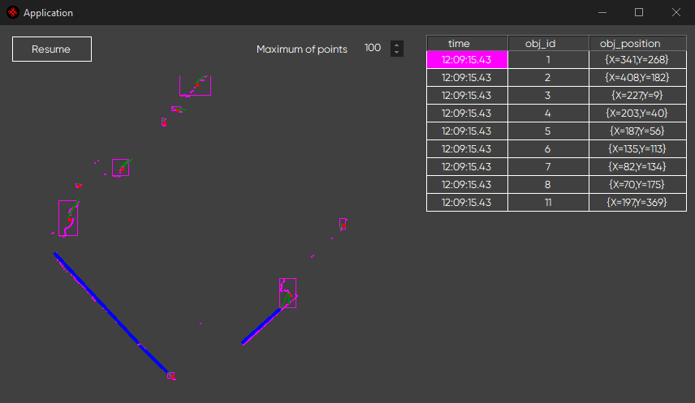

# 2D LIDAR data collection

Reads .txt file with 2D LIDAR data in bytes with time stamps, visualises it and performs segmentation of the adjacent points:

You may dump your own LIDAR data, but make sure that it follows the represented format as in `dump.txt`.

The table shows a list of segmented objects with their ids and positions.

`Maximum of points` counter shows the maximum amount of points that one object can consist of.