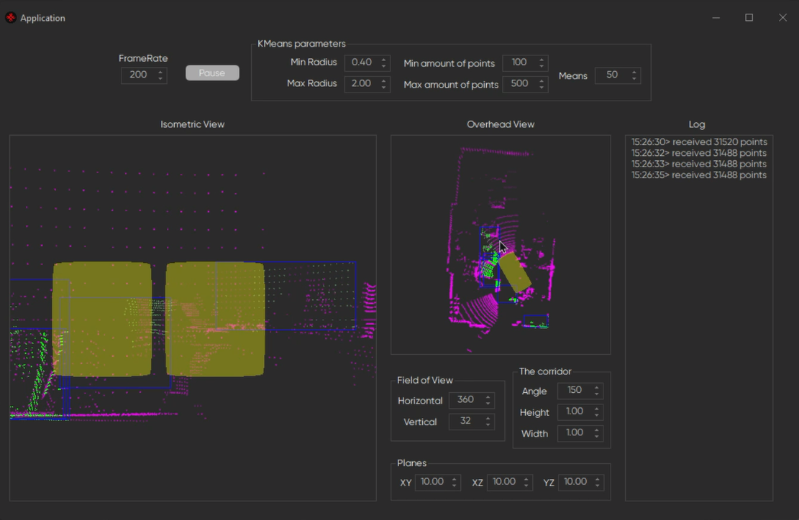
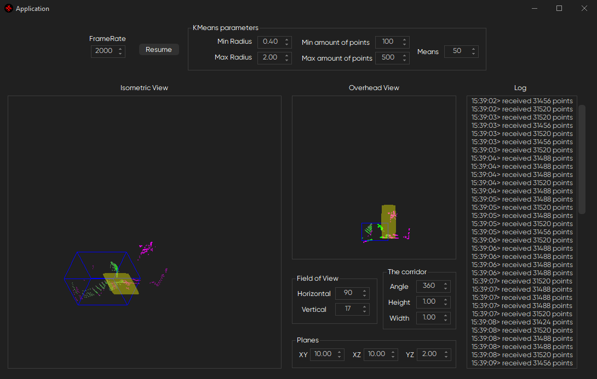

# 3D LIDAR data collection

Reads .pcap file with 3D LIDAR data in bytes with time stamps, visualises it, performs segmentation of the adjacent points via KMeans and has a feature of calculating a so-called passage (yellow panes that go through the whole image unless there are some points on the way):

You may dump your own LIDAR data, but make sure that it is .pcap.

`FrameRate` stands not as much for framerate but for the seconds of delay between the reading iterations of the data.

The block at the top of the window holds KMeans parameters, tweaking which will result in different segmentaion results.

`Field of View` and `The corridor` correspond to the visualisation limits and parameters of the cloud of points and the passage.

The block at the top stands for only limiting visualisation from either side of available space:

