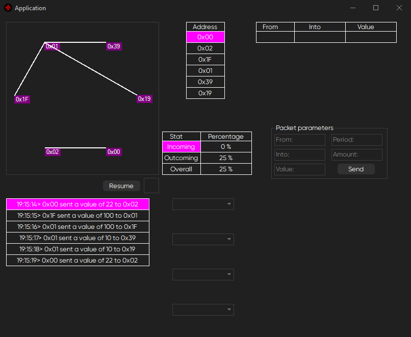
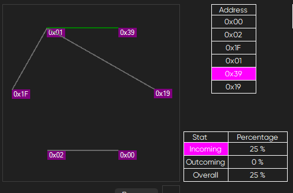
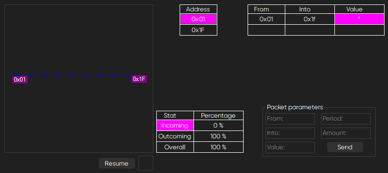
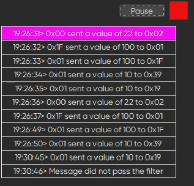
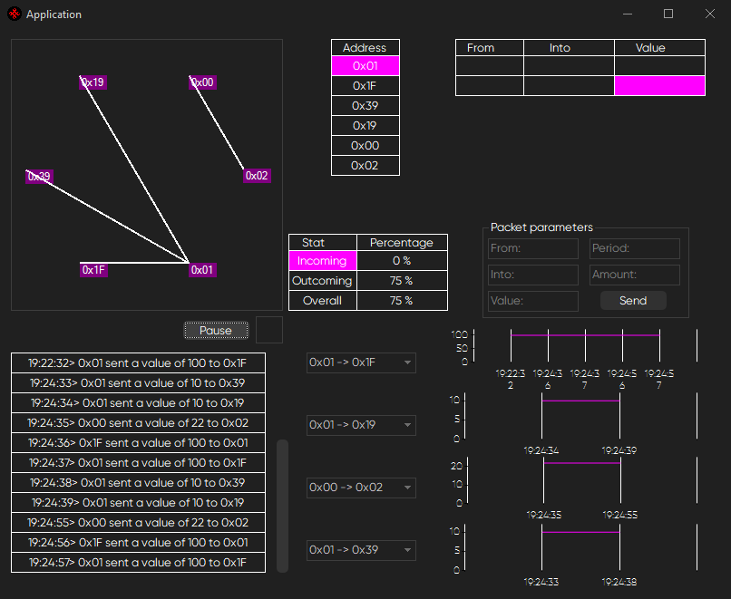

# CAN connections collection

Reads .dmp file with CAN connections data in bytes with time stamps, visualises it, shows some statistics about the line of connection and enables a filter of connections:

## Features

- You can choose one of the sources (but only if reading is paused) by address. The program will calculate and visualise the source's connectoins and percentage of incoming/outcoming messages to all of the available connections (*green line* represents an incoming message and *blue line* represents an outcoming one):

- The table at the top-right corner gives the user an option to filter all of the messages by any of the three parameters (only from a specific address, only into a specific adress, only the value passed):

- If a message does not meet the filter requirements, it is not going to be processed:

- Dropdown menus provide a choosing of the connection which could be plotted as a graph of passed messages:

- Packet parameters block allows the user to send a custom message by setting addresses of the receiver and sender, passed value, period of time in which the messages should be sent and amount of messages to send in the set period.
