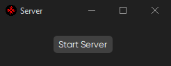
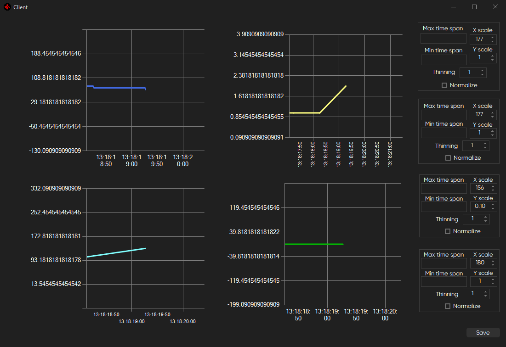

# UDP client-server data collection

Server generates four data streams with different correlations.

Client accepts that data and visualises it with an access of tweaking the ends of plots and their scales.

- `XScale` sets a scale for X axis.
- `YScale` sets a scale for Y axis.
- `Thinning` sets a sampling rate (the more the less points will be received).
- `Max Time Span` sets the upper bound for the time axis.
- `Min Time Span` sets the lower bound for the time axis.
- `Saves` the whole plot in the .png format.