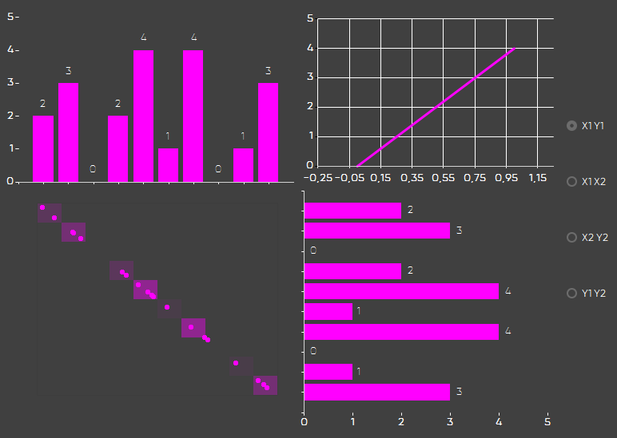
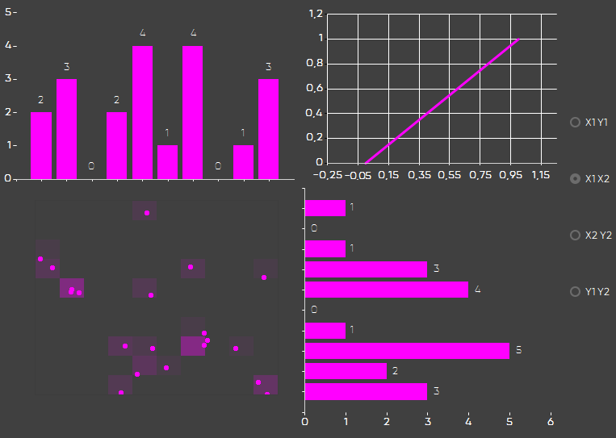
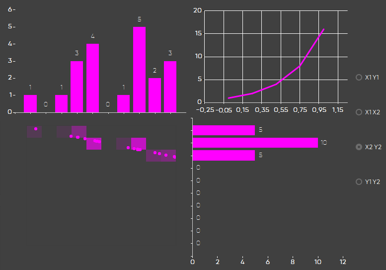
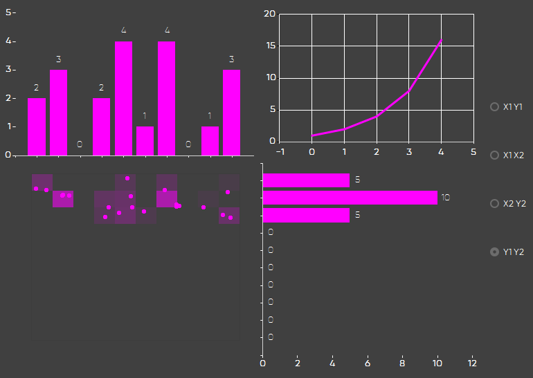

# Data generation, statistics calculation and visualisation

This program generates numbers in the set periods 0-1 for Xs.

And then maps these values according to the set keys for Ys, resulting in two new arrays of values.

To specify the amount of generated points, change `Dots count` counter and press `Generate`.

The set keys can be saved to the `settings.txt` file and imported from it.

Below the keys are calculated mathematical statistics parameters of the Ys arrays.

Histograms to either axis of the cloud of points represent numbers of points on the row / column.

Plot in the top right corner shows the correlation graph of the chosen arrays:

- X1-Y1

- X1-X2

- X2-Y2

- Y1-Y2

