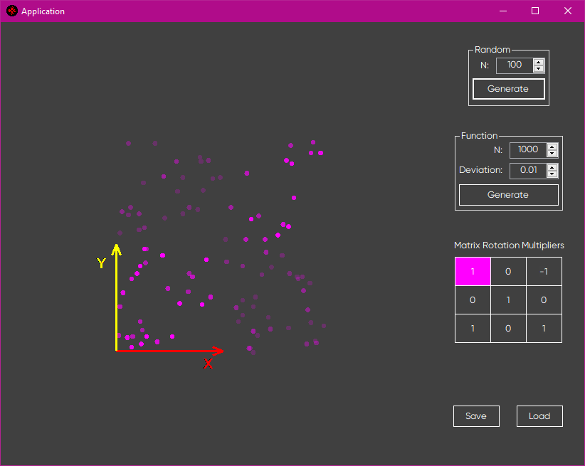
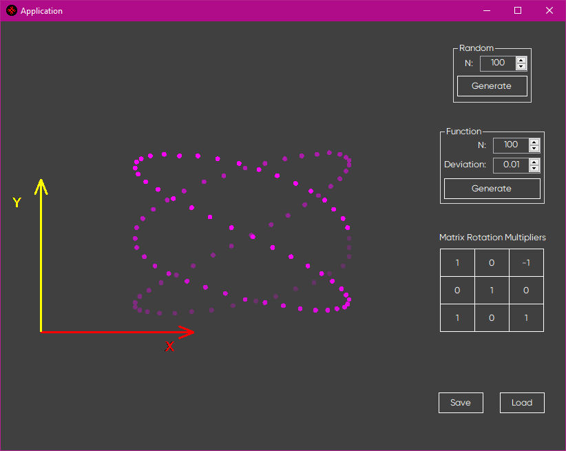

# Data generation, rotation matrix and 3D visualisation

This program generates random amount of numbers set by `N` counter.

And with a deviation set in the corresponding counter for functional generation.

The rotation matrix is set by coefficients in the table.

Generated values can be saved into a `data.csv` file and loaded from it.

The image itself is rotatable around Y-axis by dragging giving somewhat of the 3D representation. 