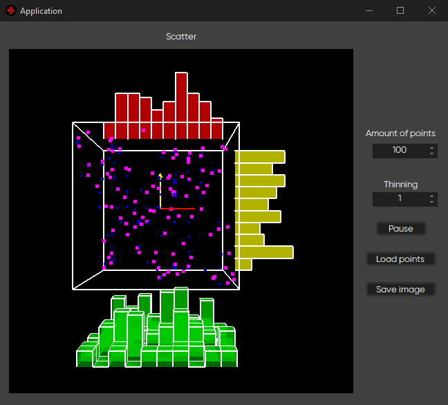
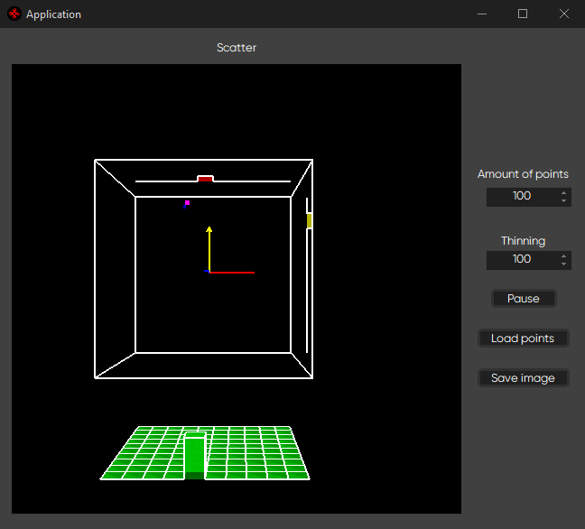

# 3D data visualisation using OpenGL

Generates a scatter plot with cloud of points inside of the cube, calculates and draws histograms on every plane of the available space that show distribution of the points inside of the cube. This distribution is also represented by blue cubes which show how a cluster of the cube is filled with points.

This program generates random amount of points set by `Amount of points` counter.

`Thinning` counter is responsible for sampling filter. More thinning = fewer points.

The image inside of the scatter widget is powered by OpenGL and is fully interactive when it comes to rotating and moving the image by dragging.

`Load points` button loads data from the `data.csv` file.

`Save image` button takes a screenshot of the OpenGL widget and saves it.