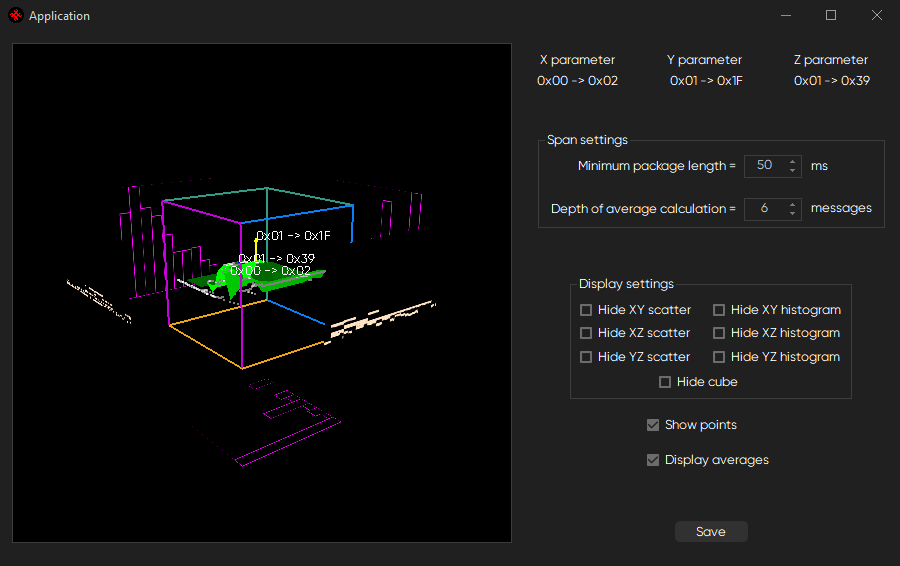

# 3D CAN connections visualisation with OpenGL

Reads a .dmp file with CAN messages log, choses three of the connections (`X parameter`, `Y parameter`, `Z parameter`) and forms a plot of their stereometrical correlation as an area.

Each side of the cube is a different statistics graph. Three of which are histograms of the points distribution regarding to every plane and the other three are projections of these points onto the planes.

- `Minimum package length` sets the minimum size of the processing arrays.

- `Depth of average calculation` corresponds to the size of the sliding average window for normalizing of the data.

- `Display settings` just enable or disable planes with graphical statistics on the main image:

- `Hide cube` disables everything inside of the cube.

- `Show points` enables the generated scatter to be displayed.

- `Display averages` displays the output of the sliding average processing.

- `Save` takes a screenshot of the main image and saves it.